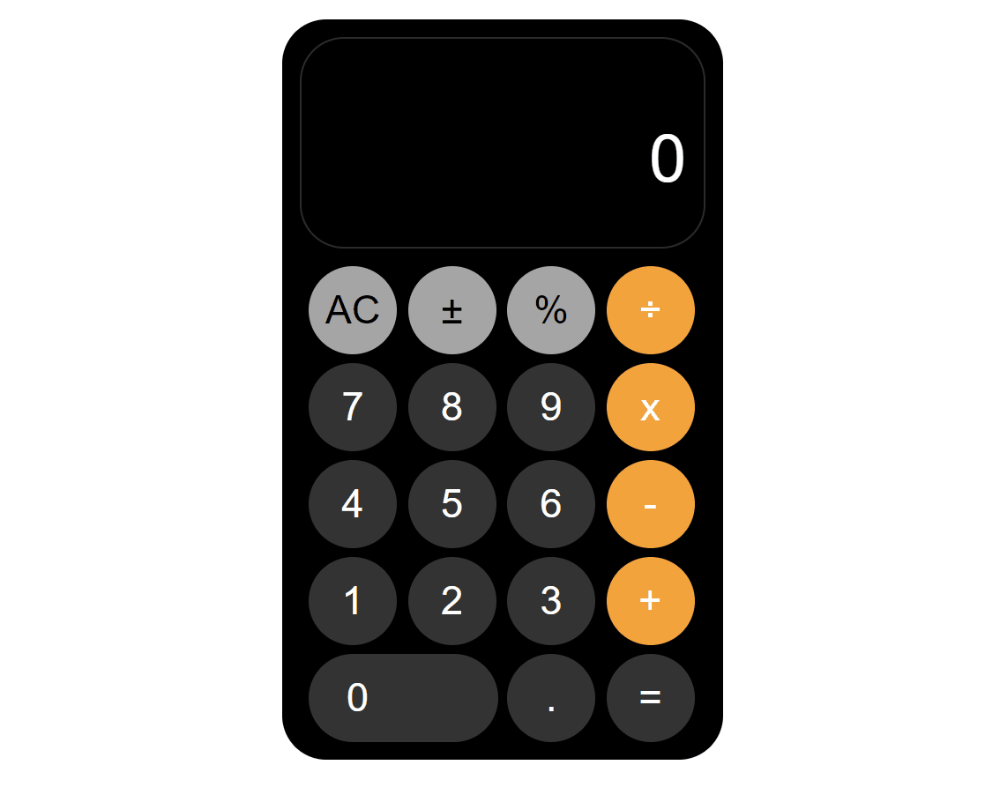

# iPhone Calculator App

<h3>visit: https://aokmen.github.io/iPhone-Calculator-App </h3>

---
# Description:

## In this project, an iPhone calculator is implemented using HTML, CSS, and JavaScript. Here is a summary of what has been done:
---
HTML Structure:

The calculator is contained within a 
 element with the class "calculator".
There are two display areas: "display-top" and "display-bottom" for showing the current calculation and result, respectively.
The buttons are organized in a grid layout within the "buttons-container" 
.
---
CSS Styling:

The calculator has a black background color with a rounded shape.
The display area has a white border, rounded corners, and is aligned to the right.
Buttons have a circular shape, a hover effect, and different background colors based on their functionality.
---
JavaScript Functionality:

Variables: operator, firstNumber, and isPreviousOperator are initialized to store the current operator, the first number in the calculation, and a flag indicating if the previous button pressed was an operator, respectively.
Event Listener: The "click" event is added to the "buttons-container" element to handle button clicks.
AC Button: Clears the display and resets the operator and number variables.
Number Buttons: Append the clicked number to the display unless it exceeds the maximum length of 11 characters.
± Button: Negates or removes the negation of the number on the display.
Decimal Button: Adds a decimal point to the display if it doesn't already contain one.
Operator Buttons: Perform calculations if there is a previous operator and a first number, then store the current operator and update the display accordingly.
Equal Button: Performs the final calculation, updates the display, adjusts the font size if necessary, and resets the operator and number variables.
